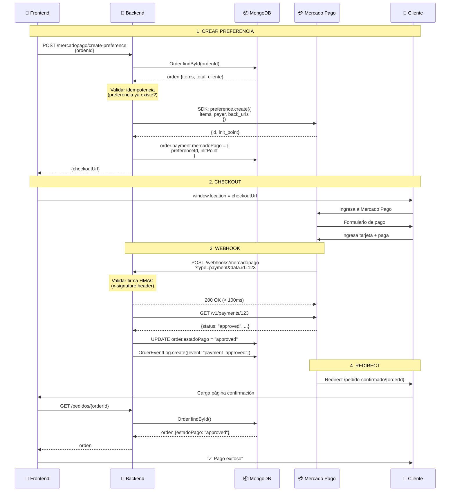

# 💳 AUDITORÍA: FLUJO MERCADO PAGO - Gaddyel

> **Basado en:** [Documentación Oficial Mercado Pago SDK v2](https://www.mercadopago.com/developers/es/docs/sdks-library/server-side)  
> **Fecha:** 25 de enero de 2026  
> **SDK:** mercadopago@2.0+ (Node.js)

---

## 📋 ÍNDICE

1. [Visión General](#-visión-general)
2. [Arquitectura del Flujo](#-arquitectura-del-flujo)
3. [Paso 1: Crear Preferencia](#-paso-1-crear-preferencia)
4. [Paso 2: Checkout del Cliente](#-paso-2-checkout-del-cliente)
5. [Paso 3: Webhook de Notificación](#-paso-3-webhook-de-notificación)
6. [Paso 4: Validación de Firma HMAC](#-paso-4-validación-de-firma-hmac)
7. [Paso 5: Confirmar Pago](#-paso-5-confirmar-pago)
8. [Seguridad Crítica](#-seguridad-crítica)
9. [Idempotencia](#-idempotencia)
10. [Manejo de Errores](#-manejo-de-errores)
11. [Testing](#-testing)
12. [Casos de Uso Especiales](#-casos-de-uso-especiales)

---

## 🎯 VISIÓN GENERAL

### ¿Qué es Mercado Pago?

Mercado Pago es la **pasarela de pagos** líder en Latinoamérica. Permite:
- ✅ Aceptar tarjetas de crédito/débito
- ✅ Pagos en efectivo (Rapipago, PagoFácil)
- ✅ Transferencias bancarias
- ✅ QR dinámico
- ✅ Cuotas sin interés (financiación)

### Flujo Simplificado

```
Cliente elige producto → Carrito → Checkout → Mercado Pago
                                                    ↓
                                              [PAGA CON TARJETA]
                                                    ↓
Backend ← Webhook (notificación) ← Mercado Pago ← Pago aprobado
   ↓
Actualiza orden a "pagado"
   ↓
Frontend ← Redirect ← Mercado Pago
   ↓
Muestra "Compra exitosa ✓"
```

---

## 🏗️ ARQUITECTURA DEL FLUJO



---

## 📝 PASO 1: CREAR PREFERENCIA

### Endpoint Backend

**Ruta:** `POST /api/mercadopago/create-preference`  
**Controller:** `mercadoPagoController.js`  
**Service:** `MercadoPagoService.js`

### Request (Frontend → Backend)

```javascript
// Frontend: Checkout.jsx
const response = await axios.post('/api/mercadopago/create-preference', {
  ordenId: "67abc123..."
});

// Response:
{
  ok: true,
  checkoutUrl: "https://www.mercadopago.com.ar/checkout/v1/redirect?pref_id=123456-abc...",
  sandboxCheckoutUrl: "https://sandbox.mercadopago.com.ar/checkout/v1/redirect?pref_id=...",
  preferenceId: "123456-abc...",
  reused: false  // true si preferencia ya existía (idempotencia)
}
```

### Código Backend (Controller)

**Archivo:** `src/controllers/mercadoPagoController.js`

```javascript
export const createCheckoutPreference = async (req, res) => {
    try {
        const { ordenId } = req.body;

        if (!ordenId) {
            return res.status(400).json({ error: 'ordenId requerido' });
        }

        // 1. Obtener orden de MongoDB
        const orden = await Order.findById(ordenId);
        if (!orden) {
            return res.status(404).json({ error: 'Orden no encontrada' });
        }

        // ✅ 2. IDEMPOTENCIA: Verificar si preferencia ya existe
        if (orden.payment?.mercadoPago?.preferenceId && orden.payment?.mercadoPago?.initPoint) {
            console.log(`♻️ Reutilizando preferencia existente`);
            
            return res.json({
                ok: true,
                checkoutUrl: orden.payment.mercadoPago.initPoint,
                sandboxCheckoutUrl: orden.payment.mercadoPago.sandboxInitPoint,
                preferenceId: orden.payment.mercadoPago.preferenceId,
                reused: true
            });
        }

        // 3. Crear nueva preferencia con MercadoPagoService
        const { preferenceId, initPoint, sandboxInitPoint } = 
            await MercadoPagoService.createPreference(orden);

        // 4. Responder al frontend
        res.json({
            ok: true,
            checkoutUrl: initPoint,
            sandboxCheckoutUrl: sandboxInitPoint,
            preferenceId
        });

    } catch (err) {
        console.error('❌ Error creando preferencia MP:', err.message);
        res.status(500).json({ error: 'Error creando checkout' });
    }
};
```

### Código Backend (Service - createPreference)

**Archivo:** `src/services/MercadoPagoService.js`

```javascript
async createPreference(order) {
    if (!this.enabled) {
        throw new Error('Mercado Pago no configurado');
    }

    try {
        console.log(`🔵 Creando preferencia para orden: ${order._id}`);

        // ✅ 1. MAPEAR ITEMS (Estructura oficial MP)
        const items = order.items.map((item, index) => {
            const itemId = `${order._id.toString()}-item-${index}`;
            const quantity = parseInt(item.cantidad) || 1;
            const unitPrice = parseFloat(item.precioUnitario) || 0;
            
            if (quantity <= 0 || unitPrice <= 0) {
                throw new Error(`Item ${index}: cantidad o precio inválidos`);
            }
            
            return {
                id: itemId,                    // ID único del item
                title: item.nombre.substring(0, 256), // Max 256 caracteres
                quantity: quantity,            // Entero positivo
                unit_price: unitPrice,         // Número decimal (precio unitario)
                currency_id: 'ARS'             // Moneda: ARS, USD, BRL, etc.
            };
        });

        // ✅ 2. AGREGAR COSTO DE ENVÍO COMO ÍTEM
        // CRÍTICO: MP no tiene campo "shipping", debe ir como item
        const costoEnvio = parseFloat(order.costoEnvio) || 0;
        if (costoEnvio > 0) {
            items.push({
                id: `${order._id.toString()}-shipping`,
                title: 'Costo de Envío',
                quantity: 1,
                unit_price: costoEnvio,
                currency_id: 'ARS'
            });
        }

        // ✅ 3. INFORMACIÓN DEL COMPRADOR
        const payer = {
            email: order.datosComprador?.email  // OBLIGATORIO
            // name, surname: OPCIONAL (comentado para evitar errores de validación)
        };
        
        if (!payer.email) {
            throw new Error('Email del comprador es requerido');
        }

        // ✅ 4. URLs DE RETORNO (Back URLs)
        const backUrls = {
            success: `${this.frontendUrl}/pedido-confirmado/${order._id}`,
            failure: `${this.frontendUrl}/pedido-fallido/${order._id}`,
            pending: `${this.frontendUrl}/pedido-pendiente/${order._id}`
        };

        // ✅ 5. CONFIGURACIÓN DE PREFERENCIA (Estándares MP SDK v2.0+)
        const preferenceData = {
            items,                              // Array de items (requerido)
            payer,                              // Info del comprador (requerido)
            back_urls: backUrls,                // URLs de redirección
            auto_return: 'all',                 // 'all' = siempre redirige | 'approved' = solo si aprobado
            external_reference: order._id.toString(), // ID de tu orden (para vincular)
            statement_descriptor: 'GADDYEL',    // Aparece en resumen de tarjeta (max 11 caracteres)
            notification_url: `${this.backendUrl}/api/mercadopago/webhook`, // Webhook URL
            payment_methods: {
                installments: 12,               // Cuotas máximas permitidas
                default_installments: 1         // Cuotas por defecto
            },
            metadata: {                         // Datos extra (opcional)
                order_id: order._id.toString(),
                order_number: order.orderNumber || 'N/A',
                created_at: new Date().toISOString()
            }
        };

        // ✅ 6. GENERAR IDEMPOTENCY KEY (evita duplicados)
        const idempotencyKey = `pref-${order._id.toString()}-${Date.now()}`;
        
        // ✅ 7. ENVIAR A MERCADO PAGO API
        const response = await this.preferenceClient.create({
            body: preferenceData,
            requestOptions: {
                idempotencyKey  // Garantiza operación única
            }
        });

        console.log(`✅ Preferencia creada: ${response.id}`);

        // ✅ 8. GUARDAR EN MONGODB
        order.payment = order.payment || {};
        order.payment.mercadoPago = {
            preferenceId: response.id,
            initPoint: response.init_point,
            sandboxInitPoint: response.sandbox_init_point,
            createdAt: new Date()
        };
        await order.save();

        return {
            preferenceId: response.id,
            initPoint: response.init_point,
            sandboxInitPoint: response.sandbox_init_point
        };

    } catch (err) {
        console.error('❌ Error en createPreference:', err.message);
        throw err;
    }
}
```

### Estructura de Preferencia (Según Docs Oficiales)

```javascript
// ✅ DOCUMENTACIÓN OFICIAL MP:
// https://www.mercadopago.com/developers/es/reference/preferences/_checkout_preferences/post

{
  // REQUERIDO: Items a pagar
  "items": [
    {
      "id": "item-1",              // ID único del item
      "title": "Toalla Premium",   // Nombre (max 256 caracteres)
      "quantity": 2,               // Cantidad (entero > 0)
      "unit_price": 2500.50,       // Precio unitario (decimal)
      "currency_id": "ARS"         // Moneda (ISO 4217)
    }
  ],
  
  // REQUERIDO: Datos del comprador
  "payer": {
    "email": "cliente@mail.com",  // Email (validación estricta)
    "name": "Juan",               // OPCIONAL
    "surname": "Pérez"            // OPCIONAL
  },
  
  // URLs de redirección
  "back_urls": {
    "success": "https://gaddyel.com/pedido-confirmado/123",
    "failure": "https://gaddyel.com/pedido-fallido/123",
    "pending": "https://gaddyel.com/pedido-pendiente/123"
  },
  
  // Auto-redirección
  "auto_return": "all",  // "approved" | "all"
  
  // Referencia externa (tu orden ID)
  "external_reference": "67abc123...",
  
  // Descriptor (aparece en resumen de tarjeta)
  "statement_descriptor": "GADDYEL",  // Max 11 caracteres
  
  // URL de webhook
  "notification_url": "https://gaddyel-backend.onrender.com/api/mercadopago/webhook",
  
  // Métodos de pago
  "payment_methods": {
    "excluded_payment_methods": [],   // Excluir métodos
    "excluded_payment_types": [],     // Excluir tipos (credit_card, debit_card, etc.)
    "installments": 12,               // Cuotas máximas
    "default_installments": 1         // Cuotas por defecto
  },
  
  // Metadatos adicionales
  "metadata": {
    "order_id": "67abc123",
    "order_number": "ORD-001",
    "created_at": "2026-01-25T10:00:00Z"
  }
}
```

---

## 🛒 PASO 2: CHECKOUT DEL CLIENTE

### Frontend Redirección

**Archivo:** `src/Paginas/Checkout.jsx`

```javascript
const handlePagar = async () => {
  try {
    // 1. Crear orden en backend
    const orderResponse = await orderService.createOrder({
      items: cartItems,
      cliente: { nombre, email, ... }
    });
    
    const { orderId } = orderResponse;
    
    // 2. Crear preferencia MP
    const mpResponse = await axios.post('/api/mercadopago/create-preference', {
      ordenId: orderId
    });
    
    const { checkoutUrl } = mpResponse.data;
    
    // 3. Redirigir a Mercado Pago
    window.location.href = checkoutUrl;
    
  } catch (error) {
    alert('Error al procesar pago: ' + error.message);
  }
};
```

### Flujo en Mercado Pago (Lado del Cliente)

```
1. Usuario ingresa a https://www.mercadopago.com.ar/checkout/v1/redirect?pref_id=...
   
2. Mercado Pago muestra:
   ┌─────────────────────────────────────┐
   │  MERCADO PAGO                       │
   │                                     │
   │  Estás pagando a: GADDYEL           │
   │  Total: $8,419.42                   │
   │                                     │
   │  🔹 Tarjeta de crédito             │
   │  🔹 Tarjeta de débito              │
   │  🔹 Efectivo (Rapipago, PagoFácil) │
   │  🔹 Transferencia bancaria         │
   │                                     │
   │  [Seleccionar método de pago]      │
   └─────────────────────────────────────┘

3. Cliente selecciona "Tarjeta de crédito"
   
4. Formulario de pago:
   ┌─────────────────────────────────────┐
   │  Número de tarjeta                  │
   │  ┌───────────────────────────────┐ │
   │  │ 4509 9535 6623 3704           │ │
   │  └───────────────────────────────┘ │
   │                                     │
   │  Vencimiento    CVV                 │
   │  ┌─────┐       ┌────┐             │
   │  │12/28│       │123 │             │
   │  └─────┘       └────┘             │
   │                                     │
   │  Nombre del titular                 │
   │  ┌───────────────────────────────┐ │
   │  │ JUAN PEREZ                    │ │
   │  └───────────────────────────────┘ │
   │                                     │
   │  Cuotas                            │
   │  ┌───────────────────────────────┐ │
   │  │ 1 cuota de $8,419.42          │ │
   │  └───────────────────────────────┘ │
   │                                     │
   │  [PAGAR]                           │
   └─────────────────────────────────────┘

5. Cliente click "PAGAR"
   
6. Mercado Pago procesa:
   - Valida tarjeta con banco
   - Autoriza transacción
   - Cobra $8,419.42
   
7. Si exitoso:
   - Muestra: "✓ Pago aprobado"
   - Envía webhook a tu backend
   - Redirige a: https://gaddyel.com/pedido-confirmado/67abc123
   
8. Si falla:
   - Muestra: "❌ Pago rechazado (fondos insuficientes)"
   - Redirige a: https://gaddyel.com/pedido-fallido/67abc123
```

---

## 🔔 PASO 3: WEBHOOK DE NOTIFICACIÓN

### ¿Qué es un Webhook?

Un **webhook** es una notificación que Mercado Pago envía a tu backend cuando ocurre un evento de pago:
- ✅ Pago aprobado → `payment.approved`
- ⚠️ Pago pendiente → `payment.pending`
- ❌ Pago rechazado → `payment.rejected`
- 💰 Contracargo → `payment.chargeback`

### Endpoint Backend

**Ruta:** `POST /api/mercadopago/webhook`  
**Controller:** `mercadoPagoController.js`

### Request (Mercado Pago → Backend)

```http
POST https://gaddyel-backend.onrender.com/api/mercadopago/webhook?type=payment&data.id=123456789
Headers:
  x-signature: ts=1706198400,v1=abc123def456...
  x-request-id: uuid-1234-5678-90ab-cdef
  content-type: application/json

Body:
{
  "action": "payment.created",
  "api_version": "v1",
  "data": {
    "id": "123456789"
  },
  "date_created": "2026-01-25T10:00:00Z",
  "id": 987654321,
  "live_mode": true,
  "type": "payment",
  "user_id": "123456"
}
```

### Query Parameters (Críticos)

| Parámetro | Descripción | Ejemplo |
|-----------|-------------|---------|
| `type` | Tipo de notificación | `"payment"` o `"merchant_order"` |
| `data.id` | ID del pago en MP | `"123456789"` |
| `id` | ID único del webhook | `987654321` |
| `live_mode` | Producción o test | `"true"` o `"false"` |

### Código Backend (handleWebhook)

**Archivo:** `src/controllers/mercadoPagoController.js`

```javascript
export const handleWebhook = async (req, res) => {
    try {
        // ✅ CRÍTICO: Responder INMEDIATAMENTE (< 100ms)
        // MP tiene timeout de 5 segundos. Si no respondemos, reintenta.
        res.status(200).json({ status: 'received' });

        // Extraer parámetros
        const type = req.query.type;              // "payment"
        const paymentId = req.query['data.id'];   // ID del pago
        const webhookId = req.query.id;           // ID del webhook
        const liveMode = req.query.live_mode === 'true';

        console.log('📨 [Webhook] Recibido:', {
            type,
            paymentId,
            webhookId,
            liveMode
        });

        // ✅ PROCESAMIENTO ASÍNCRONO (en background)
        (async () => {
            try {
                // 1. Crear log de webhook
                const webhookLog = new WebhookLog({
                    type: type || 'unknown',
                    externalId: webhookId,
                    payload: req.body,
                    ipCliente: req.ip
                });

                // 2. Firma ya validada por middleware (verifyMercadoPagoSignature)
                console.log('✅ [Webhook] Firma validada');
                
                // 3. IDEMPOTENCIA: Verificar si ya procesamos este webhook
                const webhookUniqueId = `${type}-${webhookId}-${paymentId}`;
                const existingWebhook = await WebhookLog.findOne({
                    externalId: webhookUniqueId,
                    procesadoCorrectamente: true
                });
                
                if (existingWebhook) {
                    console.log('♻️ [Webhook] Ya procesado, ignorando');
                    webhookLog.resultado = {
                        tipo: 'warning',
                        mensaje: 'Webhook duplicado'
                    };
                    await webhookLog.save();
                    return;
                }
                
                // 4. Actualizar ID único
                webhookLog.externalId = webhookUniqueId;

                // 5. PROCESAR SEGÚN TIPO
                if (type === 'payment' && paymentId) {
                    await procesarPagoConRetry(paymentId, webhookLog);
                }

                await webhookLog.save();
                console.log(`✅ [Webhook] Procesado correctamente`);

            } catch (err) {
                console.error('❌ Error procesando webhook:', err.message);
            }
        })(); // ← No esperar, ejecutar en background

    } catch (err) {
        console.error('❌ Error crítico en webhook:', err.message);
        res.status(500).json({ error: 'Internal server error' });
    }
};
```

---

## 🔐 PASO 4: VALIDACIÓN DE FIRMA HMAC

### ¿Por qué validar la firma?

**Sin validación:** Un atacante podría enviar webhooks falsos a tu backend:
```http
POST /api/mercadopago/webhook?type=payment&data.id=fake
Body: { "data": { "id": "fake" } }
```

Tu backend pensaría que el pago fue aprobado y entregaría el producto gratis.

**Con validación HMAC:** Solo webhooks firmados por Mercado Pago son aceptados.

### Header x-signature

```
x-signature: ts=1706198400,v1=abc123def456ghi789...
```

**Estructura:**
- `ts` = Timestamp Unix (segundos desde 1970)
- `v1` = Firma HMAC SHA256

### Algoritmo de Validación (Documentación Oficial MP)

```javascript
// ✅ DOCUMENTACIÓN OFICIAL:
// https://www.mercadopago.com/developers/es/docs/your-integrations/notifications/webhooks

import crypto from 'crypto';

function validateWebhookSignature(req) {
    // 1. Extraer header x-signature
    const signature = req.headers['x-signature'];
    const requestId = req.headers['x-request-id'];
    
    if (!signature || !requestId) {
        throw new Error('Missing signature headers');
    }

    // 2. Parsear ts y v1 de la firma
    const parts = {};
    signature.split(',').forEach(part => {
        const [key, value] = part.split('=');
        parts[key.trim()] = value.trim();
    });
    
    const ts = parts['ts'];
    const receivedSignature = parts['v1'];
    
    if (!ts || !receivedSignature) {
        throw new Error('Invalid signature format');
    }

    // 3. Obtener secret de .env
    const secret = process.env.MERCADO_PAGO_WEBHOOK_SECRET;
    if (!secret) {
        throw new Error('MERCADO_PAGO_WEBHOOK_SECRET not configured');
    }

    // 4. Construir manifest (según docs MP)
    const dataId = req.query['data.id'];
    const manifest = `id:${dataId};request-id:${requestId};ts:${ts};`;

    // 5. Calcular HMAC SHA256
    const expectedSignature = crypto
        .createHmac('sha256', secret)
        .update(manifest)
        .digest('hex');

    // 6. Comparar firmas
    if (expectedSignature !== receivedSignature) {
        throw new Error('Invalid signature');
    }

    // 7. Verificar timestamp (no más de 5 minutos)
    const now = Math.floor(Date.now() / 1000);
    if (Math.abs(now - parseInt(ts)) > 300) { // 5 min = 300s
        throw new Error('Signature expired');
    }

    return true;
}
```

### Middleware de Validación

**Archivo:** `src/middleware/verifyMercadoPagoSignature.js`

```javascript
import crypto from 'crypto';

export const verifyMercadoPagoSignature = (req, res, next) => {
    try {
        const signature = req.headers['x-signature'];
        const requestId = req.headers['x-request-id'];
        
        if (!signature || !requestId) {
            console.warn('⚠️ Webhook sin firma, rechazando');
            return res.status(401).json({ error: 'Unauthorized: Missing signature' });
        }

        // Parsear firma
        const parts = {};
        signature.split(',').forEach(part => {
            const [key, value] = part.split('=');
            parts[key.trim()] = value.trim();
        });
        
        const ts = parts['ts'];
        const receivedSignature = parts['v1'];
        
        if (!ts || !receivedSignature) {
            return res.status(401).json({ error: 'Invalid signature format' });
        }

        // Secret de .env
        const secret = process.env.MERCADO_PAGO_WEBHOOK_SECRET;
        if (!secret) {
            console.error('❌ MERCADO_PAGO_WEBHOOK_SECRET no configurado');
            return res.status(500).json({ error: 'Server configuration error' });
        }

        // Construir manifest
        const dataId = req.query['data.id'];
        const manifest = `id:${dataId};request-id:${requestId};ts:${ts};`;

        // Calcular HMAC
        const expectedSignature = crypto
            .createHmac('sha256', secret)
            .update(manifest)
            .digest('hex');

        // Comparar
        if (expectedSignature !== receivedSignature) {
            console.error('❌ Firma HMAC inválida');
            return res.status(401).json({ error: 'Invalid signature' });
        }

        // Verificar timestamp (5 minutos)
        const now = Math.floor(Date.now() / 1000);
        if (Math.abs(now - parseInt(ts)) > 300) {
            console.error('❌ Firma expirada');
            return res.status(401).json({ error: 'Signature expired' });
        }

        console.log('✅ Firma HMAC validada correctamente');
        next();

    } catch (error) {
        console.error('❌ Error validando firma:', error.message);
        res.status(500).json({ error: 'Signature validation error' });
    }
};
```

### Uso en Routes

```javascript
import { verifyMercadoPagoSignature } from '../middleware/verifyMercadoPagoSignature.js';

router.post(
    '/webhook',
    verifyMercadoPagoSignature,  // ← Middleware primero
    handleWebhook                // ← Controller después
);
```

---

## ✅ PASO 5: CONFIRMAR PAGO

### Obtener Detalles del Pago

**Archivo:** `src/controllers/mercadoPagoController.js` (función `procesarPago`)

```javascript
async function procesarPago(paymentId, webhookLog) {
    try {
        // 1. Obtener detalles del pago desde MP API
        const response = await axios.get(
            `https://api.mercadopago.com/v1/payments/${paymentId}`,
            {
                headers: {
                    'Authorization': `Bearer ${process.env.MERCADO_PAGO_ACCESS_TOKEN}`
                },
                timeout: 8000
            }
        );

        const payment = response.data;
        
        console.log('💳 [Payment]:', {
            id: payment.id,
            status: payment.status,
            status_detail: payment.status_detail,
            transaction_amount: payment.transaction_amount,
            external_reference: payment.external_reference
        });

        // 2. Buscar orden por external_reference
        const ordenId = payment.external_reference;
        const orden = await Order.findById(ordenId);
        
        if (!orden) {
            webhookLog.resultado = {
                tipo: 'error',
                mensaje: 'Orden no encontrada'
            };
            return;
        }

        // 3. Detectar pagos duplicados (idempotencia)
        if (orden.estadoPago === 'approved' && payment.status === 'approved') {
            console.warn('⚠️ Pago duplicado detectado, ignorando');
            webhookLog.resultado = {
                tipo: 'warning',
                mensaje: 'Pago duplicado'
            };
            webhookLog.procesadoCorrectamente = true;
            return;
        }

        // 4. Mapear status de MP a nuestro sistema
        const estadoMap = {
            'approved': 'approved',    // Aprobado
            'pending': 'pending',      // Pendiente
            'in_process': 'pending',   // En proceso
            'rejected': 'rejected',    // Rechazado
            'cancelled': 'cancelled',  // Cancelado
            'refunded': 'refunded',    // Reembolsado
            'charged_back': 'chargeback' // Contracargo
        };

        const nuevoEstado = estadoMap[payment.status] || 'unknown';

        // 5. Actualizar orden en MongoDB
        orden.estadoPago = nuevoEstado;
        orden.payment = orden.payment || {};
        orden.payment.mercadoPago = {
            ...orden.payment.mercadoPago,
            paymentId: payment.id,
            paymentStatus: payment.status,
            paymentStatusDetail: payment.status_detail,
            transactionAmount: payment.transaction_amount,
            updatedAt: new Date()
        };
        
        await orden.save();

        // 6. Registrar evento en log de auditoría
        await OrderEventLog.create({
            orderId: orden._id,
            event: payment.status === 'approved' ? 'payment_approved' : 'payment_updated',
            description: `Pago ${payment.status}: ${payment.status_detail}`,
            performedBy: 'mercadopago_webhook',
            metadata: {
                paymentId: payment.id,
                status: payment.status,
                amount: payment.transaction_amount
            }
        });

        webhookLog.resultado = {
            tipo: 'exito',
            mensaje: `Pago ${payment.status} procesado correctamente`
        };
        webhookLog.procesadoCorrectamente = true;

        console.log(`✅ Orden ${orden.orderNumber} actualizada: ${nuevoEstado}`);

    } catch (err) {
        console.error('❌ Error procesando pago:', err.message);
        webhookLog.resultado = {
            tipo: 'error',
            mensaje: err.message
        };
        throw err;
    }
}
```

### Estados de Pago (Documentación Oficial MP)

| Status MP | Status Detail | Nuestro Sistema | Descripción |
|-----------|---------------|-----------------|-------------|
| `approved` | `accredited` | `approved` | ✅ Pago aprobado y acreditado |
| `pending` | `pending_contingency` | `pending` | ⚠️ Pendiente (revisar MP) |
| `pending` | `pending_review_manual` | `pending` | ⚠️ En revisión manual |
| `in_process` | `in_process` | `pending` | ⏳ Procesando pago |
| `rejected` | `cc_rejected_insufficient_amount` | `rejected` | ❌ Fondos insuficientes |
| `rejected` | `cc_rejected_bad_filled_security_code` | `rejected` | ❌ CVV incorrecto |
| `rejected` | `cc_rejected_call_for_authorize` | `rejected` | ❌ Llamar al banco |
| `cancelled` | `by_payer` | `cancelled` | 🚫 Cancelado por comprador |
| `refunded` | `refunded` | `refunded` | 💰 Reembolsado |
| `charged_back` | `charged_back` | `chargeback` | ⚖️ Contracargo (disputa) |

---

## 🔒 SEGURIDAD CRÍTICA

### 1. Validación de Firma HMAC

✅ **Implementado:** Middleware `verifyMercadoPagoSignature`  
✅ **Algoritmo:** HMAC SHA256  
✅ **Secret:** Variable de entorno `MERCADO_PAGO_WEBHOOK_SECRET`  
✅ **Timeout:** 5 minutos (300 segundos)

### 2. Idempotencia

**Problema:** MP puede enviar el mismo webhook múltiples veces (retry si no respondemos rápido).

**Solución:**
```javascript
// ✅ IDEMPOTENCIA EN PREFERENCIA
if (orden.payment?.mercadoPago?.preferenceId) {
    return res.json({ checkoutUrl: orden.payment.mercadoPago.initPoint, reused: true });
}

// ✅ IDEMPOTENCIA EN WEBHOOK
const webhookUniqueId = `${type}-${webhookId}-${paymentId}`;
const existingWebhook = await WebhookLog.findOne({
    externalId: webhookUniqueId,
    procesadoCorrectamente: true
});

if (existingWebhook) {
    console.log('♻️ Ya procesado, ignorando');
    return;
}
```

### 3. Validación de Montos

**Problema:** Cliente manipula precio en frontend.

**Solución:**
```javascript
// ❌ NUNCA confiar en precio del frontend
const items = req.body.items; // {productoId, cantidad, precio} ← Ignorar precio

// ✅ Obtener precio REAL de MongoDB
const producto = await Producto.findById(productoId);
const precioReal = producto.precio; // ← Verdad única

// ✅ Recalcular total en servidor
const total = items.reduce((sum, item) => {
    const prod = await Producto.findById(item.productoId);
    return sum + (prod.precio * item.cantidad);
}, 0);
```

### 4. Rate Limiting

**Problema:** Atacante envía miles de webhooks falsos.

**Solución:**
```javascript
import rateLimit from 'express-rate-limit';

const webhookLimiter = rateLimit({
    windowMs: 1 * 60 * 1000, // 1 minuto
    max: 50,                 // 50 requests por IP
    message: 'Demasiadas requests de webhook'
});

router.post('/webhook', webhookLimiter, verifyMercadoPagoSignature, handleWebhook);
```

---

## 🔁 IDEMPOTENCIA

### ¿Qué es Idempotencia?

**Definición:** Una operación es **idempotente** si ejecutarla múltiples veces produce el mismo resultado que ejecutarla una vez.

**Ejemplo:**
```
// ❌ NO IDEMPOTENTE
stock = stock - 1;  // Si ejecutas 2 veces, resta 2

// ✅ IDEMPOTENTE
stock = 10;  // Si ejecutas 2 veces, sigue siendo 10
```

### Implementación en MP

#### 1. Idempotency Key en Preferencias

```javascript
// ✅ Generar clave única
const idempotencyKey = `pref-${orderId}-${Date.now()}`;

await this.preferenceClient.create({
    body: preferenceData,
    requestOptions: {
        idempotencyKey  // ← MP usa esta clave para detectar duplicados
    }
});

// Si envías 2 veces con la MISMA clave:
// - 1ra vez: Crea preferencia
// - 2da vez: Retorna la preferencia existente (no crea nueva)
```

#### 2. Verificar Preferencia Existente

```javascript
// ✅ Antes de crear preferencia, verificar si ya existe
if (orden.payment?.mercadoPago?.preferenceId) {
    return res.json({
        checkoutUrl: orden.payment.mercadoPago.initPoint,
        reused: true  // ← Indicar que fue reutilizada
    });
}
```

#### 3. Idempotencia en Webhooks

```javascript
// ✅ ID único por webhook
const webhookUniqueId = `${type}-${webhookId}-${paymentId}`;

// ✅ Buscar si ya fue procesado
const existingWebhook = await WebhookLog.findOne({
    externalId: webhookUniqueId,
    procesadoCorrectamente: true
});

if (existingWebhook) {
    console.log('♻️ Webhook duplicado, ignorando');
    return; // No procesar nuevamente
}
```

---

## ❌ MANEJO DE ERRORES

### Categorías de Errores

#### 1. Errores de Configuración

```javascript
if (!process.env.MERCADO_PAGO_ACCESS_TOKEN) {
    throw new Error('MERCADO_PAGO_ACCESS_TOKEN no configurado en .env');
}
```

**Solución:** Configurar correctamente `.env`

#### 2. Errores de Validación MP

```json
{
  "error": "bad_request",
  "message": "Invalid parameter 'items[0].unit_price': must be a positive number",
  "status": 400
}
```

**Solución:** Validar datos antes de enviar a MP

#### 3. Errores de Red

```javascript
try {
    const response = await axios.get(`https://api.mercadopago.com/v1/payments/${paymentId}`, {
        timeout: 8000  // ← 8 segundos máximo
    });
} catch (error) {
    if (error.code === 'ECONNABORTED') {
        console.error('❌ Timeout MP API (> 8s)');
        // Reintentar con exponential backoff
    }
}
```

#### 4. Errores de Firma HMAC

```
❌ Firma HMAC inválida
```

**Causas:**
- Secret incorrecto en `.env`
- Webhook no viene de MP (atacante)
- Timestamp expirado (> 5 minutos)

**Solución:**
```javascript
// Verificar que MERCADO_PAGO_WEBHOOK_SECRET sea correcto
// Obtenerlo de: https://www.mercadopago.com.ar/developers
```

### Retry con Exponential Backoff

```javascript
async function procesarPagoConRetry(paymentId, webhookLog, maxRetries = 3) {
    let attempt = 0;
    
    while (attempt < maxRetries) {
        try {
            await procesarPago(paymentId, webhookLog);
            return; // Éxito
            
        } catch (error) {
            attempt++;
            
            if (attempt >= maxRetries) {
                console.error(`❌ Falló después de ${maxRetries} intentos`);
                throw error;
            }
            
            // Exponential backoff: 1s, 2s, 4s
            const delay = Math.pow(2, attempt) * 1000;
            console.warn(`⚠️ Reintento ${attempt}/${maxRetries} en ${delay}ms...`);
            
            await new Promise(resolve => setTimeout(resolve, delay));
        }
    }
}
```

---

## 🧪 TESTING

### 1. Modo Sandbox (Test)

**Configuración:**
```bash
# .env
MERCADO_PAGO_ACCESS_TOKEN=TEST-123456-abc...  # ← Empieza con "TEST-"
MERCADO_PAGO_PUBLIC_KEY=TEST-xyz...
```

**Tarjetas de Prueba (Oficiales MP):**

| Número | CVV | Vencimiento | Resultado |
|--------|-----|-------------|-----------|
| `4509 9535 6623 3704` | `123` | `11/25` | ✅ Aprobado |
| `5031 7557 3453 0604` | `123` | `11/25` | ⚠️ Pendiente |
| `5031 4332 1540 6351` | `123` | `11/25` | ❌ Rechazado (fondos insuficientes) |
| `5031 4332 1540 6351` | `123` | `11/25` | ❌ Rechazado (CVV inválido) |

### 2. Simular Webhook en Local

```bash
# POST localhost:5000/api/mercadopago/webhook?type=payment&data.id=123
curl -X POST "http://localhost:5000/api/mercadopago/webhook?type=payment&data.id=123456789" \
  -H "Content-Type: application/json" \
  -H "x-signature: ts=1706198400,v1=abc123..." \
  -H "x-request-id: uuid-1234" \
  -d '{
    "action": "payment.created",
    "data": { "id": "123456789" },
    "type": "payment"
  }'
```

### 3. Logs de Debugging

```javascript
// En desarrollo, activar logs detallados
if (process.env.NODE_ENV === 'development') {
    console.log('🔍 [DEBUG] Preferencia:', JSON.stringify(preferenceData, null, 2));
    console.log('🔍 [DEBUG] Payment:', JSON.stringify(payment, null, 2));
}
```

---

## 🎯 CASOS DE USO ESPECIALES

### 1. Pagos en Cuotas

```javascript
payment_methods: {
    installments: 12,           // Máximo 12 cuotas
    default_installments: 1     // Por defecto: 1 cuota
}
```

**Cómo funciona:**
- Cliente elige: "3 cuotas sin interés"
- MP cobra: $8,419.42 / 3 = $2,806.47 por mes
- Tú recibes: $8,419.42 (completo) - comisión MP

### 2. Costo de Envío

```javascript
// ✅ CORRECTO: Agregar como item
items.push({
    id: `${orderId}-shipping`,
    title: 'Costo de Envío',
    quantity: 1,
    unit_price: 500,  // $500 de envío
    currency_id: 'ARS'
});

// ❌ INCORRECTO: MP no tiene campo "shipping" separado
```

### 3. Descuentos

```javascript
// ✅ Aplicar descuento ANTES de crear items
const precioConDescuento = producto.precio * 0.9; // 10% off

items.push({
    id: productId,
    title: `${producto.nombre} (10% OFF)`,
    quantity: 1,
    unit_price: precioConDescuento,
    currency_id: 'ARS'
});
```

### 4. Reembolsos (Refunds)

```javascript
import { Refund } from 'mercadopago';

const refundClient = new Refund(this.client);

// Reembolso parcial
await refundClient.create({
    payment_id: paymentId,
    amount: 1000  // Reembolsar $1000 de $8,419
});

// Reembolso total
await refundClient.create({
    payment_id: paymentId
    // Sin amount = reembolso total
});
```

---

## 📚 DOCUMENTACIÓN OFICIAL

### Links Críticos

1. **SDK Node.js:**  
   https://www.mercadopago.com/developers/es/docs/sdks-library/server-side/nodejs

2. **Crear Preferencia:**  
   https://www.mercadopago.com/developers/es/reference/preferences/_checkout_preferences/post

3. **Webhooks:**  
   https://www.mercadopago.com/developers/es/docs/your-integrations/notifications/webhooks

4. **Validación de Firmas:**  
   https://www.mercadopago.com/developers/es/docs/your-integrations/notifications/webhooks#validar-firma

5. **Estados de Pago:**  
   https://www.mercadopago.com/developers/es/docs/checkout-pro/payment-status

6. **Tarjetas de Prueba:**  
   https://www.mercadopago.com/developers/es/docs/checkout-pro/additional-content/test-cards

---

## ✅ CHECKLIST DE IMPLEMENTACIÓN

- [x] SDK oficial v2.0+ instalado (`mercadopago`)
- [x] Variables de entorno configuradas:
  - [x] `MERCADO_PAGO_ACCESS_TOKEN`
  - [x] `MERCADO_PAGO_PUBLIC_KEY`
  - [x] `MERCADO_PAGO_WEBHOOK_SECRET`
- [x] Crear preferencia con idempotency key
- [x] Verificar preferencia existente antes de crear nueva
- [x] Back URLs configuradas (success, failure, pending)
- [x] Notification URL (webhook) configurada
- [x] Middleware de validación de firma HMAC
- [x] Webhook responde < 100ms (res.status(200) inmediato)
- [x] Procesamiento asíncrono de webhook (no bloquea response)
- [x] Idempotencia en webhooks (detecta duplicados)
- [x] Retry con exponential backoff en errores
- [x] Logs de auditoría (WebhookLog, OrderEventLog)
- [x] Recálculo de precios en servidor (no confiar en frontend)
- [x] Mapeo correcto de estados MP → Sistema
- [x] Rate limiting en endpoint webhook
- [x] Tests con tarjetas de prueba en sandbox

---

**Última actualización:** 25 de enero de 2026  
**Proyecto:** Gaddyel - Flujo Mercado Pago  
**SDK:** mercadopago@2.0+ (Node.js)  
**Documentación Oficial:** [Mercado Pago Developers](https://www.mercadopago.com/developers)
